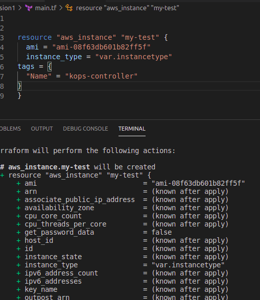
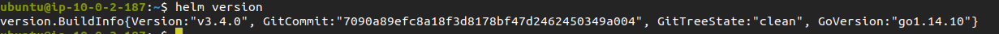
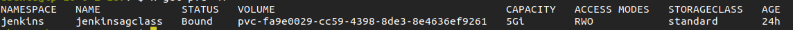

# Creating High Available Kuberenets Cluster with Kops on AWS


## Prerequisites
Before you begin this guide you’ll need the following:
Familiarity with AWS (of course), along with an AWS account
Domain to access Kubernetes APIs
Hosted Zone in Route53 for the Domain
SSL certificate using ACM for the Domain
IAM user with full S3, EC2, Route53 and VPC access
Linux machine as deployment server, preferably Ubuntu 16.04 or later
AWS-CLI version 1.16 or abovecost you.
Terraform
	   
We will create a instance on aws using terraform:


	   


You need  to run all these commands on controller and it must be having sufficient permission to perform the task.
You can use IAM role or your access keys.

sudo hostnamectl set-hostname test

## Install Kubectl binaries

sudo curl -LO https://storage.googleapis.com/kubernetes-release/release/$(curl -s https://storage.googleapis.com/kubernetes-release/release/stable.txt)/bin/linux/amd64/kubectl

sudo chmod +x ./kubectl

sudo mv ./kubectl /usr/local/bin/kubectl

##sudo curl -LO https://github.com/kubernetes/kops/releases/download/$(curl -s https://api.github.com/repos/kubernetes/kops/releases/latest | grep tag_name | cut -d '"' -f 4)/kops-linux-amd64


 sudo chmod +x kops-linux-amd64
sudo mv kops-linux-amd64 /usr/local/bin/kops
sudo kubectl cluster-info
sudo kubectl cluster-info dump
sudo echo "source <(kubectl completion bash)" >> ~/.bashrc
sudo kubectl version
sudo snap install kubectl --classic
sudo apt-get install software-properties-common
sudo apt-add-repository universe
sudo apt-get update
sudo apt-get install python-pip
sudo pip install --upgrade pip
sudo pip install awscli


Then in AWS go to identity access manager, get the user below keys, as they would help to execute aws rest api through cmd line.
Access key id:
Secret Access key:

put_ur_access_key:
put_ur_secret_access_key:

OR assign IAM role


## Now create domain and add a Route to Route53 in AWS.

Basically create the Hosted zone record for the domain.
if the domain is already registered outside, then go the outside portal, change the NS server to AWS.
(This step should have been covered in "1_Full_env_creation" file  )

Make sure our KubesMaster node is able to login Worker nodes passwordless, 
ssh-keygen
# Kops Setup
We would also require a S3 Bucket, for persistent data. 
So create a S3 bucket and give permission to EC2 instance to access that bucket.
(This step should have been covered in "1_Full_env_creation" file  )


We should try edit the cluster before making it live. so that we can  control different aspect of it, like Node flavors and etc.
so start slow with this cmd.


kops create cluster \
--state=${KOPS_STATE_STORE} \
--node-count=2 \
--master-size=t2.micro \
--node-size=t2.micro \
--zones=ap-south-1a,ap-south-1b \
--name=${KOPS_CLUSTER_NAME} \
--dns private \
--master-count 2

Hence going forward always export S3 bucket.	

export KOPS_STATE_STORE=s3://bucket-name

   
Useful cmds   
 * list clusters with: 							kops get cluster
 * edit this cluster with: 						kops edit cluster --name cluster-name
 * edit your node instance group: 				kops edit ig --name=cluster-name nodes
 * edit your master instance group: 			kops edit ig --name=cluster-name master-ap-south-1a


Once Done, save and exit.
 kops update cluster  --name=cluster-name  --state=s3://bucket-name
 kops update cluster  --name=cluster-name  --state=s3://bucket-name  --yes
 kops rolling-update cluster --name=cluster-name  --state=s3://bucket-name  --yes
 kops rolling-update cluster --yes


=========================================================================================================
## Helm setup:

 sudo curl -O https://storage.googleapis.com/kubernetes-helm/helm-v3.4.0-linux-amd64.tar.gz
 sudo tar -zxvf  helm-v3.4.0-linux-amd64.tar.gz
 sudo mv linux-amd64/helm /usr/local/bin/helm
 kubectl create serviceaccount --namespace kube-system helm
 kubectl create clusterrolebinding tiller-cluster-rule --clusterrole=cluster-admin --serviceaccount=kube-system:helm
 helm init



# High Level Jenkins deployment

kubectl create ns development

create a persistentvolumeclaim and storage class for Jenkins.

It will create EBS volume 
```
Create storage.yml
kind: StorageClass
apiVersion: storage.k8s.io/v1
metadata:
  name: standard
provisioner: kubernetes.io/aws-ebs
parameters:
  type: gp2
reclaimPolicy: Retain
mountOptions:
  - debug
than create a pvc.yml
---
kind: PersistentVolumeClaim
apiVersion: v1
metadata:
  name: jenkinsagclass
  namespace: jenkins
spec:
  storageClassName: standard
  accessModes:
  -  ReadWriteOnce
  resources:
    requests:
      storage: 5Gi
```



```
---
apiVersion: apps/v1
kind: Deployment
metadata:
  name: jenkins-server
  namespace: development
  labels:
     app: jenkins-server
spec:
  minReadySeconds: 60
  replicas: 1
  selector:
    matchLabels:
     app: jenkins-server
  template:
    metadata:
       labels:
        app: jenkins-server
    spec:
      securityContext:
         fsGroup: 110
      containers:
      - name: jenkins-server
        image:  jenkins/jenkins:latest
        imagePullPolicy:  IfNotPresent
        securityContext:
          privileged: true
        ports:
        - name: jenkinsport
          containerPort: 9090
        resources:
          limits:
            cpu: "2"
            memory: 4096Mi
          requests:
            cpu: 500m
            memory: 2000Mi
        volumeMounts:
        - name: jenkins-dir
          mountPath:  /var/lib/jenkins
      imagePullSecrets:
      volumes:
      - name: jenkins-dir
        persistentVolumeClaim:
           claimName: jenkinsagclass

```


Setup Grafana and Promethrous

kubectl create namespace monitoring

helm install prometheus stable/prometheus-operator --namespace monitoring
	  
kubectl get po -n monitoring


